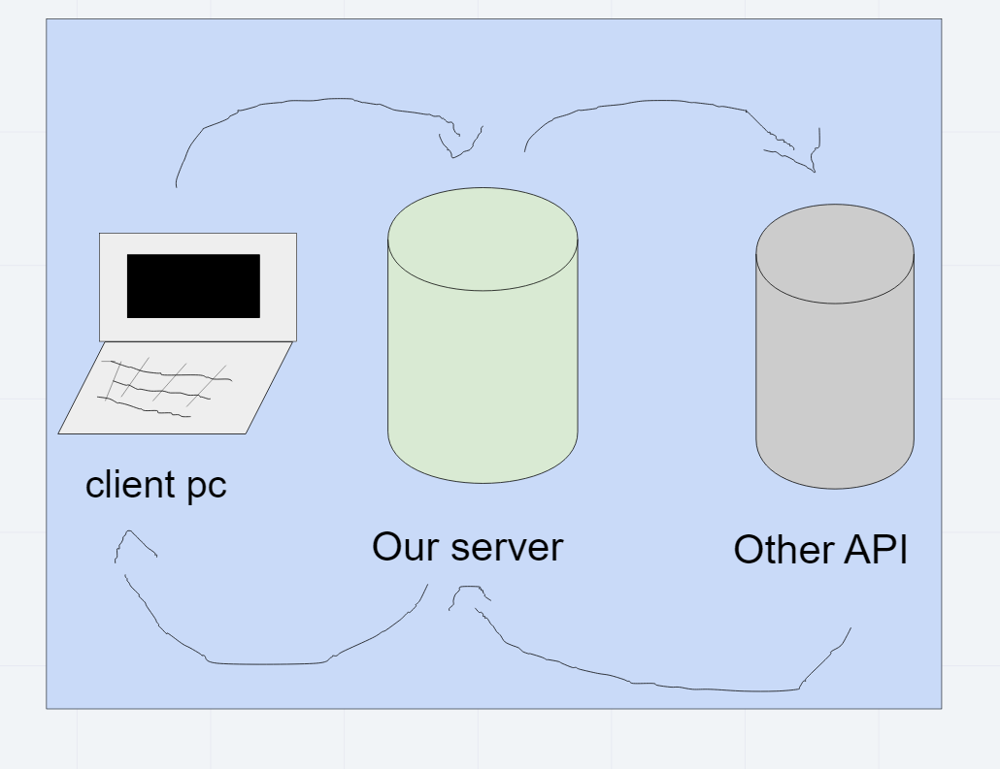

# Project Name

**Author**: Joel Connell
**Version**: 1.0.4 (increment the patch/fix version number if you make more commits past your first submission)

## Overview
This program will allow you to search a city and find a map of it and things to do in the city.
## Getting Started
The user will have to create a form that takes in the user input and sends a request to an api which will in turn return a json file with the objects wanted.
## Architecture
Axios, Cors, Javascript, React, React-Bootstrap

## Change Log

06-17-2021 7:24pm - Application now has a fully-functional express server and now user can see movies related to city.

## Credit and Collaborations
Miriam Silva, and Benjamin Ibarra Was a great help to me during this lab.

## Time estimates

Name of feature: Movies and Weather api inclusion

Estimate of time needed to complete: 8 hours

Start time: 2pm

Finish time: 7:22pm the next day

Actual time needed to complete: 2days

